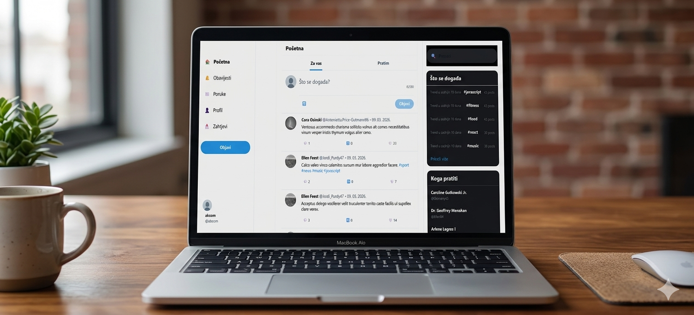
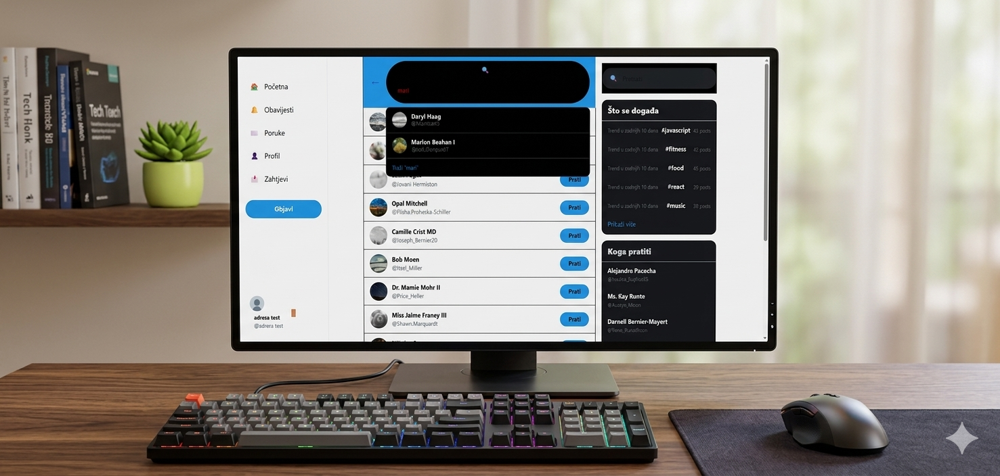
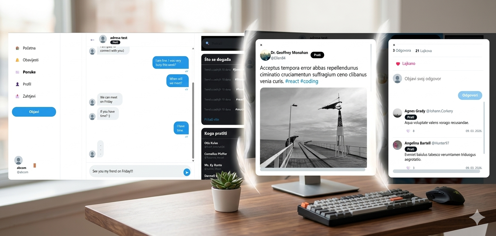

#  Twitter Clone


---

## 🎯 O projektu

Ova aplikacija predstavlja napredni **Twitter (X) klon** razvijen prvenstveno kao demonstracija stručnog poznavanja modernih tehnologija za izradu web aplikacija. Projekt služi kao vizualni i funkcionalni dokaz sposobnosti integracije kompleksnog **frontend-a** s robusnim **backend** sustavom, uz implementaciju baza podataka u containeriziranom okruženju pomoću **Dockera**.

---

## 📸 Pregled aplikacije

<p align="center">
  
</p>

---

## 🔥 Ključne Značajke

Aplikacija replicira srž Twitter korisničkog iskustva, koristeći moderne tehnologije za rad u stvarnom vremenu:

* **📝 Interaktivno objavljivanje:** Korisnici mogu kreirati, uređivati i brisati tekstualne i slikovne objave (tweetove), s automatskim ažuriranjem feeda.
* **✉️ DM Komunikacija (WebSockets):** Implementiran je sustav direktnih poruka (Direct Messages) koji omogućuje instantnu komunikaciju između korisnika bez potrebe za osvježavanjem stranice.
* **👤 Upravljanje profilima:** Svaki korisnik ima prilagodljiv profil. Sustav omogućuje posjećivanje tuđih profila, pregled njihovih objava te dinamičku interakciju.
* **🤝 Sustav praćenja (Follow):** Korisnici mogu pratiti druge profile, što direktno utječe na sadržaj njihovog glavnog "Početna" feeda.

---

  


---

## 💬 Interakcija i Komunikacija

Projekt implementira kompletan ekosustav društvene interakcije, omogućujući korisnicima javnu i privatnu razmjenu informacija u stvarnom vremenu.


### 1. Privatne Poruke (Direct Messages)
Sustav za dopisivanje omogućuje izravnu, privatnu komunikaciju između korisnika:
* **Real-time Chat:** Zahvaljujući WebSoketima, poruke se razmjenjuju trenutno bez potrebe za osvježavanjem stranice.
* **Povijest razgovora:** Pregledan ispis poruka s vizualnim indikatorima (status slanja i primanja).
* **Intuitivno sučelje:** Jednostavan unos poruka s fokusom na brzinu i preglednost.

### 2. Javni Feed & Angažman
Srž aplikacije je javni zid gdje se odvija glavna aktivnost:
* **Objave (Tweets):** Korisnici dijele multimedijalni sadržaj, misli i tehničke novosti (podrška za hashtagove poput `#react` i `#coding`).
* **Komentiranje:** Svaka objava podržava duboke razine konverzacije kroz sustav odgovora (Replies).
* **Lajkanje:** Vizualna povratna informacija o popularnosti sadržaja kroz interaktivne gumbe za lajkanje.

### 3. Sustav Praćenja i Obavijesti
* **Follow System:** Mogućnost praćenja drugih profila kako bi se personalizirao Home feed.
* **Pametne Notifikacije:** Korisnici dobivaju obavijesti u stvarnom vremenu za nove poruke, lajkove, komentare i nove pratitelje.
* **Pretraga & Prijedlozi:** Integriran sustav pretrage korisnika i pametni prijedlozi za praćenje na temelju aktivnosti.

---
  

---

## 🛠️ Tehnički Stack

- **Frontend:** React.js s Tailwind CSS-om za moderan i responzivan dizajn.
- **Backend:** Node.js / Express (integriran s WebSocket protokolom).
- **Baza podataka:** Firebase / MongoDB (ovisno o tvojoj trenutnoj implementaciji).
- **Infrastruktura:** Docker za laku portabilnost i postavljanje razvojnog okruženja.

---

## 🛠️ API Dokumentacija (Backend)

Sve API rute počinju s `/api`. Većina ruta je zaštićena `JWT authMiddleware`-om.

### 🔐 Autentifikacija (`/auth`)
| Metoda | Ruta | Opis | Autentifikacija |
| :--- | :--- | :--- | :---: |
| `POST` | `/register` | Registracija novog korisnika | ❌ |
| `POST` | `/login` | Klasična prijava (JWT) | ❌ |
| `GET` | `/google` | Google OAuth prijava | ❌ |
| `GET` | `/verify-email` | Verifikacija putem emaila | ❌ |

### 🐦 Tweetovi & Interakcije (`/tweets`, `/likes`, `/comments`)
| Metoda | Ruta | Opis | Autentifikacija |
| :--- | :--- | :--- | :---: |
| `GET` | `/tweets` | Dohvaćanje feeda (javno/opcionalno) | 🔓 |
| `POST` | `/tweets` | Kreiranje tweeta (podržava do 4 slike) | ✅ |
| `GET` | `/tweets/following` | Feed samo od ljudi koje pratite | ✅ |
| `POST` | `/tweets/:id/retweet` | Retweet funkcionalnost | ✅ |
| `POST` | `/likes/tweet/:id/like` | Lajkanje/Uklanjanje lajka s tweeta | ✅ |
| `POST` | `/comments` | Dodavanje komentara na tweet | ✅ |

### 👥 Korisnici & Praćenje (`/users`, `/follow`)
| Metoda | Ruta | Opis | Autentifikacija |
| :--- | :--- | :--- | :---: |
| `GET` | `/users/profile` | Dohvaćanje vlastitog profila | ✅ |
| `PUT` | `/users/profile` | Ažuriranje profila (avatar upload) | ✅ |
| `GET` | `/users/u/:username` | Pretraga korisnika po username-u | ✅ |
| `POST` | `/follow/:id` | Zaprati korisnika (ili pošalji zahtjev) | ✅ |
| `GET` | `/follow/requests` | Lista zahtjeva za privatne profile | ✅ |

### 💬 Poruke & Notifikacije (`/message`, `/notifications`)
| Metoda | Ruta | Opis | Autentifikacija |
| :--- | :--- | :--- | :---: |
| `POST` | `/message/send` | Slanje DM poruke | ✅ |
| `GET` | `/message/conversations` | Lista svih razgovora | ✅ |
| `GET` | `/notifications` | Dohvaćanje svih obavijesti | ✅ |
| `PATCH` | `/notifications/read-all`| Označavanje svih obavijesti pročitanim | ✅ |

### 🔍 Ostalo (`/suggestions`)
| Metoda | Ruta | Opis | Autentifikacija |
| :--- | :--- | :--- | :---: |
| `GET` | `/suggestions` | Prijedlozi ljudi za praćenje | ✅ |
| `GET` | `/suggestions/mentions` | Prijedlozi za @mention kod tipkanja | ✅ |

---


## 🛣️ Frontend Rute (Klijent)

Aplikacija je izgrađena kao **Single Page Application (SPA)** koristeći `react-router-dom`. Većina ruta je zaštićena i dostupna samo prijavljenim korisnicima.

### 🔓 Javne rute
| Ruta | Komponenta | Opis |
| :--- | :--- | :--- |
| `/login` | `<Login />` | Stranica za autentifikaciju korisnika. |
| `/register` | `<Register />` | Kreiranje novog korisničkog računa. |
| `/verify-email` | `<VerifyEmail />` | Stranica za potvrdu email adrese. |
| `/login-success`| `<LoginSuccess />` | Callback stranica nakon Google OAuth prijave. |

### 🔐 Zaštićene rute (Potrebna prijava)
| Ruta | Komponenta | Opis |
| :--- | :--- | :--- |
| `/` | `<Home />` | Glavni feed s tweetovima i formom za objavu. |
| `/notifications` | `<Notifications />` | Pregled svih interakcija i obavijesti. |
| `/messages` | `<Messages />` | Popis svih aktivnih razgovora (Direct Messages). |
| `/messages/:userId`| `<ChatDetail />` | Privatni chat s određenim korisnikom (WebSockets). |
| `/profile` | `<Profile />` | Pregled i uređivanje vlastitog profila. |
| `/profile/:username`| `<Profile />` | Pregled profila drugih korisnika. |
| `/search` | `<Search />` | Globalna pretraga korisnika i sadržaja. |

---

## 🏗️ Arhitektura Frontenda

* **State Management:** Korišten je **MobX** (`AuthStore`) za reaktivno upravljanje stanjem autentifikacije i korisničkim podacima.
* **Layout:** Sustav stupaca (Sidebar, Main Content, Right Panel) koji se dinamički prilagođava ovisno o statusu prijave.
* **UX Features:**
    * **Conditional Rendering:** Sidebar i RightPanel se prikazuju samo autentificiranim korisnicima.
    * **Smooth Scroll:** Implementiran "Scroll to Top" gumb koji se pojavljuje nakon 400px skrolanja.
    * **Auth Guards:** Automatsko preusmjeravanje neovlaštenih korisnika na `/login`.


---

## 🚀 Instalacija i Pokretanje

Projekt je moguće pokrenuti lokalno koristeći Docker (preporučeno) ili ručno instalacijom ovisnosti.

### 📋 Preduvjeti
* [Node.js](https://nodejs.org/) (verzija 16.x ili novija)
* [Docker](https://www.docker.com/) i Docker Compose

### 1. Kloniranje projekta
```bash
git clone [https://github.com/josipdom03/Twiter_clone.git](https://github.com/josipdom03/Twiter_clone.git)
cd Twiter_clone

###2. Konfiguracija okruženja (.env)
Prije pokretanja, osiguraj da imaš .env datoteku unutar /backend direktorija s potrebnim podacima (npr. Mailtrap, JWT secret, itd.).
Docker će automatski povući te varijable.

###3. Pokretanje putem Dockera (Preporučeno)
Ova metoda automatski podiže MySQL bazu, Node.js API i Vite frontend.
```bash
docker-compose up --build
```
Nakon pokretanja, frontend će biti dostupan na `http://localhost:5173`, a backend API na `http://localhost:5000/api`.

### 4. Ručno pokretanje (alternativa)
Ako želiš pokrenuti aplikaciju bez Dockera, slijedi ove korake:
#### Backend
```bash
cd backend
npm install
npm start
```
#### Frontend
```bash
cd frontend
npm install
npm run dev
```
Nakon pokretanja, frontend će biti dostupan na `http://localhost:5173`, a backend API na `http://localhost:5000/api`.
---
## 📝 Zaključak
Ovaj projekt demonstrira naprednu implementaciju Twitter klona koristeći moderne web tehnologije. Integracija real-time komunikacije, kompleksnih interakcija i skalabilne arhitekture čini ovaj projekt impresivnim primjerom stručnosti u izradi web aplikacija.

